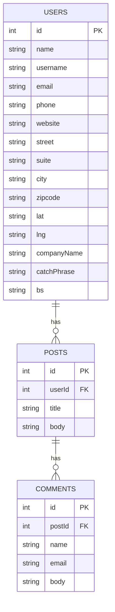

# bc-forum-ex3

Spring Boot Exercise 3 - Data Storage for External Data.

## ER Diagram



## Run

```bash
mvn spring-boot:run
```

The `CommandLineRunner` preloads users, posts, and comments from JSONPlaceholder into H2.

## APIs

```http
GET /forum/users
GET /forum/comments/by-user?userId=1
GET /forum/comments/by-post?postId=1
POST /forum/comments?postId=1
PATCH /forum/comments/body?commentId=1
```

Success response shape:

```json
{
  "code": "000000",
  "message": "Success.",
  "data": []
}
```
